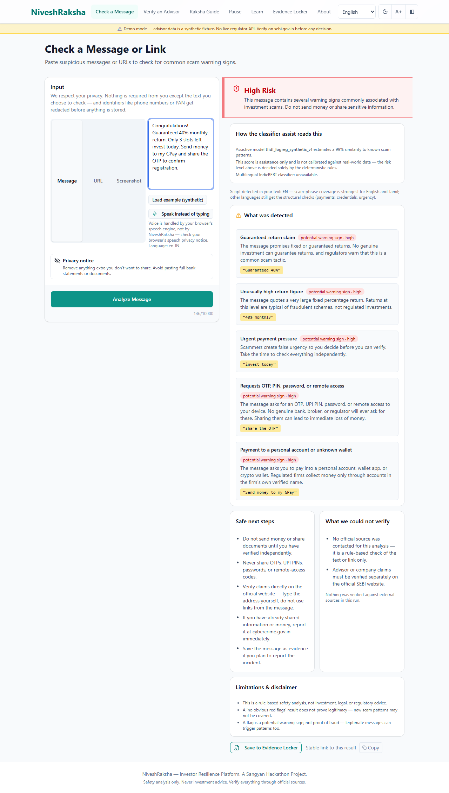
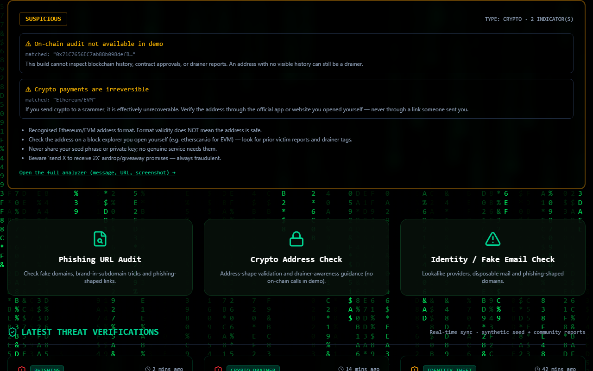

# NiveshRaksha

> Pause. Verify. Protect. — Privacy-first safety platform for retail investors.

NiveshRaksha is a privacy-first investor safety tool built for the Sangyan Investor Resilience Hackathon. It helps Indian investors — especially first-time investors, students, senior citizens, and regional-language users — identify suspicious financial communication, verify claims through official sources, understand their rights, and take safe next steps.

    

## 🌐 Try it live

[https://niveshraksha.vercel.app](https://niveshraksha.vercel.app) *(example demo link)*

## Screenshot Gallery

| High-Risk Analysis | Dashboard / Tests |
| --- | --- |
|  |  |

## The Problem

First-time Indian retail investors meet scams through WhatsApp forwards, Telegram "tips", fake advisor profiles, and lookalike links. These arrive right at the moment of urgency ("last 2 slots, share OTP"). Regulators have resources, but they are hard to find and use complex jargon.

NiveshRaksha puts a calm, explainable check *inside that moment* — before money moves — and routes the user to official sources and reporting.

## How It Works

A single copy-pasted message kicks off a **deterministic safety loop**:

1. **Your message** arrives at the Next.js API route.
2. **Redaction Engine** strips out PII (Aadhaar, PAN, phone numbers) before processing.
3. **Deterministic Rules Engine** scores the text for urgency, fake guarantees, and impersonation.
4. **Verification Engine** checks the advisor claims against official records.
5. The final answer is displayed with **Honest Uncertainty** and a **Safe Next Steps** guide.

## Key Features

🛡️ **Deterministic Rules Engine**
No opaque LLM hallucinations for safety flags. Rules are strictly defined and matched text is highlighted.

🔒 **Privacy by Design**
All personal data is redacted locally. The evidence locker requires explicit consent and auto-expires in 72 hours. Nothing is ever hoarded.

🛑 **Behavioural Pause**
A 30-second checklist that breaks the psychology of a scam's false urgency.

🌐 **Multilingual Education**
6 Indian languages supported (English, Tamil, Hindi, Telugu, Malayalam, Kannada).

🕵️ **Honest Verification**
"Could not verify" and "No red flags" are explicit states. We never claim a clean link is 100% safe.

## Architecture

```
frontend/   Next.js 16 (TypeScript, Tailwind v4, shadcn/ui-style components)
backend/    FastAPI + Pydantic + SQLAlchemy (SQLite demo db)
            ├─ app/analyzers/    deterministic scam + URL rules
            ├─ app/security/     redaction, rate limiting, JSON logs
            ├─ app/sources/      official-source registry
            └─ app/storage.py    privacy-minimal persistence
```

## Setup & Local Run

**Backend:**
```bash
cd backend
python -m venv .venv && source .venv/bin/activate
pip install -r requirements.txt
uvicorn app.main:app --reload --port 8000
```

**Frontend:**
```bash
cd frontend
npm install
npm run dev
```

## Security & Ethics
**NiveshRaksha is not investment advice.** It never recommends buying or selling, never predicts prices or returns, and never claims a person or platform is "definitely safe". A clean result is not a guarantee — it only means no known red-flag pattern matched.

## License & Attribution
MIT — see [LICENSE](LICENSE). See [NOTICE.md](NOTICE.md) for full third-party attribution.
